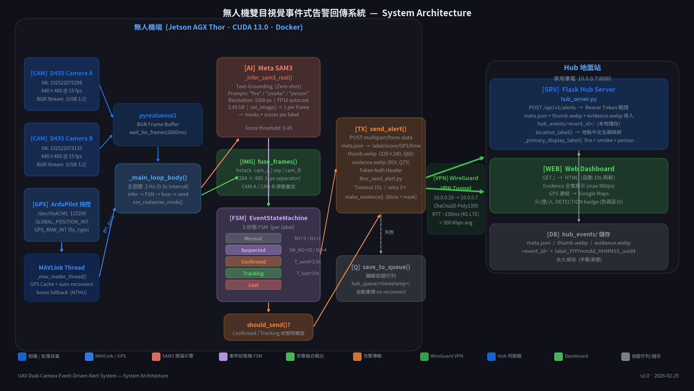

# UAV Dual-Camera Event-Driven Alert System
**無人機雙目視覺事件式告警回傳系統**

> 平台：NVIDIA Jetson AGX Thor · Intel RealSense D435 × 2 · ArduPilot MAVLink  
> 模型：Meta SAM3 Text-Grounding（零樣本偵測）  
> 網路：WireGuard VPN（Thor 10.0.0.20 → Hub 10.0.0.7）

---

## 系統特色

- **事件式傳輸**：靜默期頻寬 0，僅在 Confirmed/Tracking 狀態才上傳影像
- **零樣本偵測**：SAM3 Text-Grounding，Prompt = `["fire","smoke","person"]`，無需重新訓練
- **FSM 假陽性抑制**：5 狀態有限狀態機過濾瞬間誤偵測
- **雙相機融合**：兩台 D435 水平拼接，擴大 FOV

---

## 檔案說明

| 檔案 | 說明 |
|------|------|
| `thor_dualcam_event_sender.py` | 主程式：雙 D435 + SAM3 + MAVLink + FSM + 傳輸 |
| `thor_send_alert.py` | 傳輸函式庫：multipart POST、make_evidence()、離線 queue |
| `hub_server.py` | Hub Flask 伺服器（在筆電執行） |
| `run_uav_alert.sh` | Docker 啟動腳本（含相機/飛控掛載） |
| `draw_arch.py` | 系統架構圖產生腳本（matplotlib） |
| `make_ppt.py` | 簡報產生腳本（python-pptx） |
| `decord.py` | SAM3 訓練依賴 stub（推論不需要） |
| `SYSTEM_PAPER.md` | 完整系統論文文件（v2.0，879 行） |
| `system_arch.png` | 系統架構圖 |
| `UAV_Alert_System_Presentation.pptx` | 簡報（16 張投影片） |

---

## 快速啟動

### Hub 端（筆電）

```bash
pip install flask
python hub_server.py
# Dashboard: http://localhost:8080
```

### UAV 端（Jetson AGX Thor）

```bash
# 設定 HuggingFace Token（首次需要）
export HF_TOKEN="your_hf_token_here"

# 啟動 Docker 推論
./run_uav_alert.sh
```

> `run_uav_alert.sh` 需要 `uav-fire-detector:latest` Docker image（含 PyTorch 2.9 + pyrealsense2）

---

## 系統架構



---

## 硬體需求

| 元件 | 規格 |
|------|------|
| 計算平台 | NVIDIA Jetson AGX Thor (sm_110, CUDA 13.0) |
| 相機 | Intel RealSense D435 × 2 |
| 飛控 | ArduPilot (MAVLink, /dev/ttyACM1) |
| 網路 | WireGuard VPN |

---

## 環境變數

執行前請設定以下環境變數（不要 commit 真實 token）：

```bash
export HF_TOKEN="hf_xxxxxxxx"          # HuggingFace token（下載 SAM3）
# hub_server.py 內的 AUTH_TOKEN 請自行修改為隨機長字串
```

---

## License

MIT
